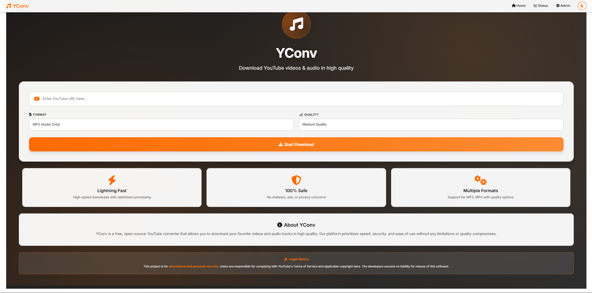
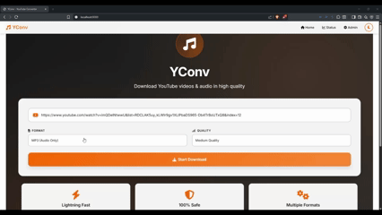
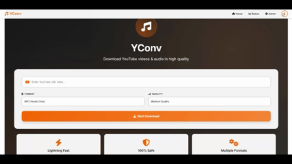

# 🎵 YConv – Self-Hosted YouTube MP3 / MP4 Downloader

<div align="center">


**A clean, self-hosted YouTube converter with no ads, no tracking, and no limits.**

[Features](#-features) • [Demo](#-demo) • [Installation](#%EF%B8%8F-installation) • [Tech Stack](#-tech-stack) • [Legal](#-legal-notice)



</div>

---

## ⚠️ Legal Notice

> **🚨 IMPORTANT: This project is for educational and personal use only.**
> 
> - Users are **solely responsible** for complying with YouTube's Terms of Service
> - Downloading copyrighted content without permission may violate laws in your country
> - The developers assume **no liability** for misuse of this software
> - By using this software, you agree to use it responsibly and legally

---

## 🚀 Demo

<div align="center">

**Download Workflow**



**Dark Mode Theme**



</div>

---

## ✨ Features

| Feature | Description |
|---------|-------------|
| 🎬 **MP4 Video Download** | High, medium, and low quality options |
| 🎵 **MP3 Audio Extraction** | Crystal-clear audio conversion |
| 🌙 **Dark/Light Mode** | Easy on the eyes, day or night |
| 📊 **Real-time Status** | Track your downloads live |
| 📂 **One-Click Folder Access** | Open downloads folder instantly |
| 🔒 **100% Private** | Self-hosted, no data leaves your machine |
| 🐳 **Docker Ready** | Deploy in seconds |
| 📱 **Responsive Design** | Works on mobile and desktop |

---

## 🛠 Tech Stack

| Layer | Technology |
|-------|------------|
| **Backend** | Django 3.2, Python 3.11 |
| **Downloader** | yt-dlp |
| **Audio Processing** | pydub, FFmpeg |
| **Frontend** | Bootstrap 5, Font Awesome |
| **Database** | SQLite |
| **Containerization** | Docker, Docker Compose |

---

## ⚙️ Installation

### 🐳 Docker (Recommended)

The fastest way to get started:

```bash
# Clone the repository
git clone https://github.com/yourusername/YoutubeConverter.git
cd YoutubeConverter

# Run with Docker
docker-compose up --build
```
```bash
# Run in background
docker-compose up -d --build

# Stop
docker-compose down
```

That's it! Open http://localhost:8000 🎉


#### Persistent Data
Downloads and database are stored in Docker volumes:
- `yconv_downloads` - Your downloaded files
- `yconv_data` - Database
- `yconv_sessions` - User sessions

---

### 💻 Manual Installation

<details>
<summary>Click to expand manual setup instructions</summary>

#### Prerequisites
- Python 3.9+
- FFmpeg (for audio conversion)

#### Steps

```bash
# Clone the repository
git clone https://github.com/yourusername/YoutubeConverter.git
cd YoutubeConverter

# Install dependencies
cd backend
pip install -r requirements.txt

# Run migrations
python manage.py migrate

# Start the server
python manage.py runserver
```

Open http://localhost:8000 in your browser.

</details>

---

## 📁 Project Structure

```
YoutubeConverter/
├── backend/              # Django backend
│   ├── cfe/              # Project configuration
│   ├── youtube/          # Main application
│   ├── media/            # Downloaded files
│   └── manage.py
├── frontend/             # Frontend assets
│   ├── templates/        # HTML templates
│   └── static/           # CSS, images
├── Dockerfile
├── docker-compose.yml
└── README.md
```

---

## 📝 Changelog

### v2.0 (Latest)
- 🎨 New black & orange theme
- 🌙 Dark/Light mode toggle
- 📂 Open downloads folder button
- 🐳 Docker support
- ⚡ Improved download queue system

### v1.3
- User authentication
- Status page auto-refresh
- Download queue system

### v1.2
- Multiple download requests
- Status page implementation

---

## 🤝 Contributing

Contributions are welcome! Feel free to:
- 🐛 Report bugs
- 💡 Suggest features
- 🔧 Submit pull requests

---

## ⭐ Star History

If you find this project useful, please consider giving it a star! ⭐

---

<div align="center">

Made with ❤️ by [Your Name]

</div>
- Friendship system that allows users to interact with each other and share their queries
